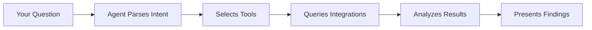

Before diving into Hiro's features, it helps to understand the key concepts that power your AI Security Engineer.

## How Hiro Works

Hiro is an AI Security Engineer powered by large language models. It:

- **Understands natural language** — Ask questions like you would to a colleague
- **Has deep tool knowledge** — Knows how to query Okta, AWS, CrowdStrike, and other integrations
- **Correlates across systems** — Connects activity from one system to another automatically
- **Maintains context** — Remembers your conversation history for follow-up questions

<Info>
Hiro uses advanced language models combined with specialized security knowledge to ensure accurate, actionable responses.
</Info>

### The Investigation Process

When you ask Hiro a question, it:

1. **Parses your intent** — Understands what you're asking about (users, IPs, timeframes, etc.)
2. **Selects relevant tools** — Chooses which integrations to query
3. **Executes queries** — Calls APIs to fetch data from your security tools
4. **Analyzes results** — Identifies patterns, anomalies, and connections
5. **Responds with findings** — Presents actionable information in natural language

## Threat Indicators

Hiro tracks threat indicators—specific pieces of data that help identify malicious activity. Each indicator includes provenance tracking so you know where it came from.

| Indicator Type | Example | Common Sources |
|---------------|---------|----------------|
| IP Address | `185.220.101.1` | Okta logs, CloudTrail, CrowdStrike |
| User Email | `john@company.com` | Okta, Google Workspace |
| AWS Principal | `arn:aws:iam::123:user/admin` | CloudTrail, IAM |
| Access Key | `AKIA...` | CloudTrail |
| GitHub Username | `jsmith` | GitHub audit logs |
| Okta User ID | `00u1a2b3c4d5e6f7g` | Okta system logs |

When Hiro discovers a new indicator during an investigation, it:
- Records where it was discovered
- Automatically scans related systems
- Adds it to the threat context for future queries

## Chat vs Fight Mode

Hiro offers two primary modes of operation:

### Chat Mode

Best for **ad-hoc investigations** and **exploratory analysis**.

- Conversational interface
- Ask questions, get answers
- Follow-up questions maintain context
- Manual, on-demand queries

**Use Chat when:** You need to investigate a specific alert, answer a question, or explore your security data.

### Fight Mode

Best for **active incidents** and **continuous threat hunting**.

- Continuous, looping investigation
- Automatic indicator discovery
- Continuous scanning (~15 second cycles)
- Proposed remediation actions
- Session persistence

**Use Fight Mode when:** You're responding to an active threat and need continuous monitoring and rapid response.

<CardGroup cols={2}>
  <Card title="Chat Interface" icon="message" href="/features/chat-interface">
    Learn more about conversational investigations.
  </Card>
  <Card title="Fight Mode" icon="swords" href="/features/fight-mode">
    Deep dive into continuous threat hunting.
  </Card>
</CardGroup>

## Approval Levels

Hiro uses a tiered approval system to ensure humans stay in control of high-impact actions.

### Read-Only Tools (No Approval)

Most investigation tools require no approval:
- Querying logs
- Listing users
- Fetching configuration
- Reading audit trails

### Approval-Required Actions

Remediation actions that modify state require explicit approval:

| Action | Integration | Impact |
|--------|-------------|--------|
| Suspend user | Okta | Locks user out of all SSO apps |
| Clear sessions | Okta | Forces re-authentication |
| Terminate instance | AWS EC2 | Stops and removes instance |
| Delete IAM user | AWS IAM | Removes AWS access |
| Contain host | CrowdStrike | Network-isolates endpoint |
| Revoke tokens | GitHub | Invalidates access tokens |

<Warning>
Hiro will never execute a high-impact action without your explicit approval. You always see what action will be taken, the expected impact, and Hiro's confidence level before approving.
</Warning>

### Confidence Scores

When proposing actions, Hiro provides a confidence score indicating how certain it is that the action is appropriate:

- **High (80%+)** — Strong evidence supports this action
- **Medium (50–80%)** — Reasonable evidence, but review recommended
- **Low (below 50%)** — Limited evidence, proceed with caution

## Integrations

Hiro's power comes from deep integrations with your security stack. Each integration provides:

- **Query tools** — Read-only access to fetch data
- **Mutation tools** — Actions that modify state (with approval)
- **Skills** — Specialized knowledge about the platform

See the [Integrations Overview](/integrations/overview) for the full list of supported tools.

## Sessions and Persistence

### Chat History

Chat conversations are automatically saved and can be resumed later. Each conversation maintains:
- Full message history
- Context about investigated threats
- Previously discovered indicators

### Fight Mode Sessions

Fight Mode sessions persist across browser sessions:
- Resume active investigations
- Review historical sessions
- Track all proposed and executed actions
- Full audit trail

## Next Steps

<CardGroup cols={2}>
  <Card title="Chat Interface" icon="message" href="/features/chat-interface">
    Master conversational investigations.
  </Card>
  <Card title="Fight Mode" icon="swords" href="/features/fight-mode">
    Learn continuous threat hunting.
  </Card>
  <Card title="Integrations" icon="plug" href="/integrations/overview">
    Connect your security tools.
  </Card>
  <Card title="Remediation" icon="hammer" href="/features/remediation">
    Understand available actions.
  </Card>
</CardGroup>
