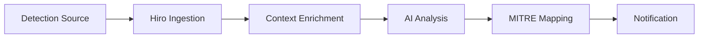

Hiro ingests security detections from your connected sources, enriches them with AI-generated analysis, and helps you investigate and respond to threats efficiently.

## Detection Sources

Hiro can ingest detections from:

| Source | Detection Types |
|--------|----------------|
| **CrowdStrike** | Endpoint threats, malware, suspicious behavior |
| **AWS GuardDuty** | Cloud infrastructure threats |
| **Okta** | Authentication anomalies, policy violations |
| **Custom Webhooks** | Any detection system with webhook support |

## How Detections Work

When a detection is received:

1. **Ingestion** — Detection is received via webhook or API poll
2. **Enrichment** — Hiro queries related systems for context
3. **AI Summary** — A concise, actionable summary is generated
4. **MITRE Mapping** — Detection is mapped to ATT&CK techniques
5. **Deduplication** — Related alerts are correlated
6. **Notification** — You're alerted based on severity



## Viewing Detections

Navigate to **Detections** in the left sidebar to see your detection queue.

### Detection List

Detections are displayed with:

- **Severity** — Critical, High, Medium, Low
- **Title** — Brief description of the threat
- **Source** — Where the detection originated
- **Time** — When the detection occurred
- **Status** — New, Investigating, Resolved

### Filtering and Sorting

Filter detections by:
- Severity level
- Source system
- Time range
- Status
- MITRE technique

## Detection Details

Click any detection to see full details:

### AI Summary

Hiro generates a concise summary explaining:
- What happened
- Why it matters
- Recommended next steps

```
SUMMARY: Credential Access Attempt Detected

A user's AWS access key was used to attempt AssumeRole calls
to 15 different roles across 3 AWS accounts over a 5-minute period.
This pattern is consistent with credential theft and privilege
escalation attempts.

The access key belongs to john@company.com and was last rotated
90 days ago. The API calls originated from IP 185.220.101.1,
which is not associated with known company infrastructure.

RECOMMENDED: Deactivate the access key immediately and investigate
the user's Okta session for signs of compromise.
```

### MITRE ATT&CK Mapping

Detections are mapped to relevant MITRE ATT&CK techniques:

| Technique | Name | Description |
|-----------|------|-------------|
| T1078 | Valid Accounts | Use of valid credentials |
| T1098 | Account Manipulation | Attempt to modify privileges |
| T1538 | Cloud Service Dashboard | Cloud console access |

### Raw Detection Data

The original detection payload is preserved and accessible for detailed analysis.

## Investigating Detections

From any detection, you can:

### Start Chat Investigation

Click **Investigate in Chat** to open a conversation pre-loaded with detection context:

```
Hiro: I've loaded the context from this detection. The CrowdStrike
alert shows ransomware indicators on endpoint LAPTOP-A1B2C3.
What would you like to investigate first?

You: What user was logged into this endpoint at the time?
```

### Start Fight Mode

For active threats, click **Investigate in Fight Mode** to begin continuous hunting with the detection's indicators already loaded.

### View Related Detections

Hiro correlates related detections automatically:

```
RELATED DETECTIONS (3)
─────────────────────
• [High] AWS GuardDuty: Unusual API calls from same access key (2 hours ago)
• [Medium] Okta: Login from new device for same user (3 hours ago)
• [Low] CrowdStrike: New process on same endpoint (4 hours ago)
```

## Detection Status Workflow

Manage detection status as you work:

| Status | Description |
|--------|-------------|
| **New** | Detection received, not yet reviewed |
| **Investigating** | Active investigation in progress |
| **Pending Action** | Awaiting remediation approval |
| **Resolved** | Investigation complete, threat mitigated |
| **False Positive** | Confirmed not a threat |

## Configuring Detection Sources

### CrowdStrike

CrowdStrike detections are automatically ingested when you connect the integration. Configure which detection types to receive in [**Settings > Integrations > CrowdStrike**](https://app.hiro.is/settings/integrations).

### AWS GuardDuty

GuardDuty findings are pulled when you connect your AWS account. All finding types are ingested by default.


## Notification Settings

Configure how you're notified about new detections:

| Channel | Configuration |
|---------|--------------|
| **In-App** | Always enabled for all severities |
| **Email** | Configurable by severity threshold |
| **Slack** | Send to channel with @mention for critical |

Configure notifications in [**Settings > Notifications**](https://app.hiro.is/settings/notifications).

## Best Practices

### Triage by Severity

Focus on Critical and High severity detections first. Use filtering to manage your queue effectively.

### Correlate Before Acting

Check related detections before taking action—what looks like multiple incidents may be a single attack.

### Use AI Summaries

Hiro's AI summaries provide quick context without reading raw logs. Trust but verify for critical decisions.

### Mark False Positives

Marking false positives helps improve detection quality over time and keeps your queue clean.

## Next Steps

<CardGroup cols={2}>
  <Card title="Chat Interface" icon="message" href="/features/chat-interface">
    Investigate detections conversationally.
  </Card>
  <Card title="Fight Mode" icon="swords" href="/features/fight-mode">
    Hunt threats continuously.
  </Card>
  <Card title="Remediation" icon="hammer" href="/features/remediation">
    Take action on detected threats.
  </Card>
  <Card title="Integrations" icon="plug" href="/integrations/overview">
    Connect more detection sources.
  </Card>
</CardGroup>
