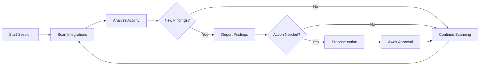

Fight Mode is Hiro's continuous threat hunting capability. Unlike the Chat interface which responds to individual queries, Fight Mode runs in a loop—continuously scanning your integrations, discovering new indicators, and proposing remediation actions in real-time.

## When to Use Fight Mode

Use Fight Mode when:

- **Active incident** — You're responding to a confirmed or suspected breach
- **Threat hunting** — You want to continuously monitor for specific indicators
- **Incident response** — You need real-time visibility and rapid remediation
- **Investigation at scale** — The threat involves multiple systems and indicators

<Info>
Fight Mode is designed for situations where threats evolve faster than you can manually query each system.
</Info>

## How Fight Mode Works

Fight Mode operates in continuous cycles, scanning your integrations and reporting findings in real-time.

### Response Times

| Phase | Expected Time |
|-------|---------------|
| Initial scan after session start | 5–10 seconds |
| Each scanning cycle | ~15 seconds |
| Action execution after approval | 1–3 seconds |
| New indicator discovery scan | 5–10 seconds |

<Info>
Response times depend on the number of connected integrations and the volume of activity being analyzed. Complex queries across multiple systems may take longer.
</Info>

### The Scanning Loop



Each cycle, Hiro:

1. **Queries all connected integrations** for activity matching known threat indicators
2. **Discovers new indicators** — IPs, users, credentials, resources
3. **Reports specific findings** with exact timestamps from logs
4. **Proposes remediation actions** when threats are confirmed
5. **Executes approved actions** immediately
6. **Adds new indicators** to the threat context for future scans

## Starting a Fight Mode Session

<Steps>
  <Step title="Navigate to Fight Mode">
    Click **Fight Mode** in the left sidebar.
  </Step>
  <Step title="Start a new session">
    Click **New Session** to begin.
  </Step>
  <Step title="Provide initial indicators">
    Enter the initial threat context:
    ```
    Investigate suspicious login from IP 185.220.101.1. The user
    john@company.com reported their account was compromised.
    ```
  </Step>
  <Step title="Watch Hiro hunt">
    Fight Mode begins scanning immediately. You'll see real-time updates as Hiro discovers activity.
  </Step>
</Steps>

## The Fight Mode Interface

The Fight Mode interface is divided into several panels:

### Threat Indicators Panel

Shows all tracked indicators with their provenance:

| Indicator | Type | Source |
|-----------|------|--------|
| `185.220.101.1` | IP Address | Initial input |
| `john@company.com` | Email | Initial input |
| `AKIA...XYZ` | AWS Access Key | Discovered from CloudTrail |
| `jane@company.com` | Email | Discovered from shared session |

### Findings Feed

Real-time stream of discoveries with timestamps:

```
[14:32:15] Okta: User john@company.com logged in from 185.220.101.1
[14:32:16] Okta: Session created, app access granted to 3 applications
[14:32:18] AWS: CloudTrail shows API calls from john@company.com
[14:32:19] AWS: New access key created: AKIA...XYZ
[14:32:21] GitHub: Repository clone from john@company.com
```

### Proposed Actions Panel

Actions awaiting your approval:

```
PROPOSED ACTION: Suspend Okta User
─────────────────────────────────
User: john@company.com
Reason: Compromised credentials detected
Evidence:
  - Login from known malicious IP 185.220.101.1
  - Unusual access key creation in AWS
  - Repository access outside normal hours
Confidence: High (92%)

[Approve]  [Reject]  [More Info]
```

### Executed Actions Log

Audit trail of all actions taken:

```
[14:35:22] EXECUTED: Cleared Okta sessions for john@company.com
[14:35:24] EXECUTED: Deactivated AWS access key AKIA...XYZ
[14:38:15] EXECUTED: Suspended Okta user john@company.com
```

## Threat Indicator Types

Hiro tracks multiple indicator types during Fight Mode:

| Type | Example | Use Case |
|------|---------|----------|
| IP Address | `185.220.101.1` | Source of malicious activity |
| User Email | `john@company.com` | Compromised or suspicious user |
| AWS Principal ARN | `arn:aws:iam::123:user/admin` | Cloud identity |
| AWS Access Key | `AKIA...` | Potentially stolen credentials |
| Okta User ID | `00u1a2b3c4d5e6f7g` | Internal Okta identifier |
| GitHub Username | `jsmith` | Source code access |
| Custom Identifier | Any string | LLM-discovered identifiers |

When a new indicator is discovered, Hiro automatically:
- Adds it to the tracking list with source information
- Scans the last 12 hours of logs for historical activity
- Includes it in future scan cycles

## Approving Actions

When Hiro proposes an action, you'll see:

- **Action description** — What will be done
- **Target** — The affected user, resource, or system
- **Reason** — Why this action is recommended
- **Evidence** — Supporting findings from the investigation
- **Confidence score** — How certain Hiro is about this action

<Warning>
All high-impact actions require explicit approval. Hiro will never suspend users, terminate instances, or revoke access without your consent.
</Warning>

### Approval Workflow

1. **Review the action** — Read the description, reason, and evidence
2. **Check confidence** — Higher confidence means stronger evidence
3. **Decide**:
   - **Approve** — Execute the action immediately
   - **Reject** — Skip this action, continue scanning
   - **More Info** — Ask Hiro for additional context

## Session Persistence

Fight Mode sessions are saved automatically. You can:

- **Pause and resume** — Close your browser and continue later
- **Review history** — Access completed sessions from **Fight Mode > History**
- **Export findings** — Download a full report of the session

<Tip>
Sessions include a complete audit trail of all findings, proposed actions, and executed remediations—useful for post-incident reviews.
</Tip>

## Best Practices

### Start with Specific Indicators

```
# Good
Investigate IP 185.220.101.1 and user john@company.com

# Less effective
Something seems wrong with our Okta logs
```

### Provide Context

```
Investigate IP 185.220.101.1. This IP was flagged by our firewall
at 2pm today. The user john@company.com may be compromised.
```

### Don't Over-Scope

Focus Fight Mode on specific incidents. For broad security posture analysis, use the Chat interface instead.

### Review Before Approving

Even with high confidence scores, take a moment to review the evidence before approving destructive actions.

## Transitioning from Chat

You can escalate from a Chat investigation to Fight Mode:

```
This looks like an active attack. Start Fight Mode with the
indicators we've discussed.
```

Hiro will:
1. Create a new Fight Mode session
2. Import all discovered indicators
3. Begin continuous scanning immediately

## Next Steps

<CardGroup cols={2}>
  <Card title="Remediation Actions" icon="hammer" href="/features/remediation">
    See all available actions and approval levels.
  </Card>
  <Card title="Detections" icon="bell" href="/features/detections">
    Learn how Hiro ingests and manages security detections.
  </Card>
</CardGroup>
